# Parlex v1.5.0 Technical Design Specification

**Date:** 2026-08-31  
**Target Version:** `1.5.0-beta.1` (`versionCode`: 10)  
**Target Hardware:** Snapdragon 845 (Xiaomi Mi 8, `ce2d4fa1`) & Snapdragon 8 Gen 3 (OnePlus Pad 2, `4c88a73b`), Android 15.

---

## 1. Problem Statement & Scope Overview

User feedback and real-world device testing have identified key areas for enhancement and bug remediation:

1. **Screen Translation Overlay (Google Circle-Style In-Place Overlays)**:
   - **Current Defect**: Screen translation triggers visual scanning animation, but fails to render in-place text overlays directly over original text bounding boxes. Previously, frame processing took $>60\text{ s}$ with misaligned coordinates, and touching anywhere on the screen dismissed the translation prematurely.
   - **MediaProjection Lifecycle Bug**: Tapping the floating translation button multiple times unexpectedly kicks the user back into the main app and requests MediaProjection screen recording permissions repeatedly.
   - **Interactive Expandable Toolbar ("T" Icon)**: The user needs an expandable floating quick-control dock allowing:
     - Target language selection.
     - Mode selection: Fast NMT (ML Kit ~20ms) vs Local LLM Deep Translate.
     - Saving translations (capturing original screenshot with annotated bilingual overlay).
     - State-aware button color transitions (Idle Teal $\to$ Scanning Amber $\to$ Complete Emerald).

2. **Dialogue Voice Recording & Timeline History**:
   - **Background Audio Recording**: Configurable setting in Preferences ("Запись аудио в диалоге" / "Record dialogue audio") with format selection (WAV / AAC / Opus). When active, conversation audio is persisted in app storage alongside Room DB session metadata.
   - **Chronological Timeline & Metrics**: In the History tab, dialogue sessions display a granular chronological timeline with speaker codes, timestamps, original/translated text, audio playback scrubbers, and aggregate speaking metrics (word count, letter count, duration).
   - **Local LLM Conversation Summarizer**: An on-device "Summarize with LLM" action powered by LiteRT-LM (Gemma 3B) or Llama.cpp (Hy-MT2) that generates concise takeaways and intent analysis from the conversation history.

3. **Currency Conversion Attribution & Offline Caching**:
   - Explicitly document and clarify in Settings that currency rates operate 100% offline via a once-daily snapshot from official open central bank baselines, with manual sync capability when network is available.

4. **Visual Language Identification & "About App" Metadata**:
   - Emoji country flags (`🇷🇺`, `🇬🇧`, `🇻🇳`, `🇨🇳`, `🇪🇸`, `🇩🇪`) are permitted exclusively for language pickers in Text Translation, while voice dialogue retains monochrome ISO badges (`[RU]`, `[EN]`).
   - Settings "О приложении" section updated to `1.5.0-beta.1` with current AI model and native engine catalog.

---

## 2. Architecture & Subsystem Decomposition

```mermaid
graph TD
    subgraph Screen Translation Subsystem
        A[Floating 'T' Button] -->|Single Tap| B[ScreenOverlayService]
        B -->|Hardware VirtualDisplay| C[ScreenCaptureHelper]
        C -->|Raw Bitmap ~30ms| D[OcrMnnRuntime / DBNet]
        D -->|Bounding Boxes + Text Polygons| E[FastTranslateEngine]
        E -->|Translated Text Array| F[InPlaceOverlayView]
        F -->|Render in-place over original coordinates| G[Display AR View]
        A -->|Tap 'T' Icon| H[Expandable Floating Radial Toolbar]
        H --> I[Language Picker / Mode Toggle / Save Screenshot]
    end

    subgraph Voice Dialogue Recording Subsystem
        J[DialogueViewModel.startConversation] --> K[DialogueAudioRecorder]
        K -->|Background Audio Buffer| L[Opus/AAC Encoder]
        L -->|Session Audio File| M[Internal App Storage]
        N[DialogueViewModel.processDialogueTurn] --> O[Room DB DialogueMessage + Audio Timestamps]
        O --> P[History Timeline Screen]
        P -->|On-demand inspect| Q[LLM Summarizer LiteRT / Llama.cpp]
    end
```



---

## 3. Detailed Component Specifications

### 3.1. Phase S: Screen Translation Overlay & Interactive Toolbar

#### Sub-Phase S1.1: MediaProjection Lifecycle & Permission Bugfix
- **Root Cause**: `ScreenOverlayService` was recreating `MediaProjection` instances on every tap, causing the system projection token to invalidate and triggering `startActivity` to re-prompt permissions.
- **Solution**: Retain the `MediaProjection` callback and virtual display token in `ScreenCaptureHelper` as a persistent session singleton until the overlay service is explicitly stopped. Debounce rapid button clicks with a mutex guard.
- **Color State Machine**:
  - `IDLE`: Primary Teal container.
  - `SCANNING / CAPTURING`: Amber container with rotating pulse indicator.
  - `TRANSLATING`: Indigo container with live shimmer.
  - `DISPLAYING`: Emerald container with active overlay badge.

#### Sub-Phase S1.2: Google Circle-Style In-Place AR Overlays
- **Coordinate Transformation**: Translate MNN DBNet polygon coordinates to exact screen display pixels accounting for status bar / navigation bar insets and device display density (`440 dpi` on Mi 8, `3000x2120` on OnePlus Pad 2).
- **Adaptive Contrast Backplate**: Render semi-opaque tinted rounded rectangles behind translated text blocks to preserve readability over complex backgrounds.
- **Fast NMT Batching**: Execute concurrent Fast NMT batch translations across all detected bounding boxes within $<50\text{ ms}$.
- **Touch & Dismiss Handling**: Window manager layout params configured with `FLAG_NOT_TOUCH_MODAL` and an explicit close anchor so the overlay remains stable during screen dimming / ambient touches.

#### Sub-Phase S1.3: Expandable Floating Translator Toolbar ("T" Icon)
- **Radial / Pill Toolbar**: Tapping the floating "T" icon animates an expandable Compose overlay dock containing:
  1. `Language Selector`: Source $\leftrightarrow$ Target fast switcher.
  2. `Translation Mode Switcher`: Fast NMT vs LLM Direct.
  3. `Save Screenshot Action`: Merges original screen bitmap with translated AR bounding boxes and exports to `Pictures/Parlex/`.
  4. `Close / Minimize`: Cleanly hides AR overlay while keeping the floating button docked at the screen edge.

---

### 3.2. Phase H: Dialogue Audio Recording & LLM Conversation Summarizer

#### Sub-Phase H1.1: Background Dialogue Audio Recorder
- **Service Integration**: In `DialogueViewModel`, when `settings.recordDialogueAudio == true`, instantiate `DialogueAudioRecorder` utilizing `AudioRecord` / `MediaCodec` (AAC-LC / Opus at 16kHz mono).
- **Session File Management**: Save audio as `dialogue_session_<id>.m4a` under `context.filesDir/dialogue_records/`.
- **Settings Toggle**: Add "Запись аудио в диалоге" switch in Settings with format choices (AAC, WAV).

#### Sub-Phase H1.2: Dialogue Session Timeline Player & Statistics
- **Room Database Schema**:
  - Add `audioStartTimeMs: Long` and `audioDurationMs: Long` to `DialogueMessage`.
  - Add `audioFilePath: String?` to `DialogueSession`.
- **History UI Overhaul**:
  - Interactive chronological timeline showing turns with synchronized audio playback scrubbers.
  - Aggregate metrics card: total conversation time, word count (speaker A vs speaker B), and character volume.

#### Sub-Phase H1.3: Local LLM Dialogue Summarization Engine
- **Engine**: Leverage `LiteRtTranslationEngine` (Gemma 3B) or `TranslationEngine` (Hy-MT2 GGUF).
- **Prompt Architecture**:
  ```
  You are an on-device conversation analyst. Summarize the following bilingual dialogue:
  [Speaker RU]: ...
  [Speaker EN]: ...
  Provide:
  1. Key summary (2-3 sentences).
  2. Main decisions/action items.
  ```
- Render summary directly in the History inspect bottom sheet.

---

### 3.3. Phase C: Daily Offline Currency Rate Cache & Attribution

#### Sub-Phase C1.1: Daily Rate Snapshot & Transparency Notice
- **Attribution Card**: Clarify in Settings under "Конвертер валют" that rates are cached daily from open exchange reference data (ECB / Central Bank baseline) and operate 100% offline.
- **Manual Sync Action**: Provide a "Обновить курсы" button that refreshes the daily offline cache when internet is available.

---

### 3.4. Phase V: Visual Flags in Text Translation & App Metadata

#### Sub-Phase V1.1: Language Country Emoji Flags & Version 1.5.0-beta.1 Catalog
- **Emoji Country Flags**: Update `Language.kt` and `LanguagePicker.kt` in Text Translation mode to render standard country emoji flags (`🇷🇺`, `🇬🇧`, `🇻🇳`, `🇨🇳`, `🇪🇸`, `🇩🇪`, `🇫🇷`, `🇯🇵`, `🇰🇷`, `🇹🇭`, `🇸🇦`, `🇹🇷`, `🇮🇹`), while strictly maintaining monochrome ISO badges in voice Dialogue.
- **Version Bump**: `versionCode = 10`, `versionName = "1.5.0-beta.1"`.
- **About App Screen**: Update Settings -> "О приложении" with the full model catalog (Hy-MT2 1.8B/7B, TranslateGemma LiteRT, Sherpa-ONNX, Fast NMT, MNN OCR).

---

## 4. Multi-Phase Execution Matrix

| Phase | Sub-Phase | Title | Primary Components | Verification |
|---|---|---|---|---|
| **Phase S** | **S1.1** | MediaProjection Lifecycle & Permission Bugfix | `ScreenOverlayService`, `ScreenCaptureHelper` | JVM tests + device multi-click verify |
| **Phase S** | **S1.2** | Google Circle-Style In-Place AR Text Overlays | `InPlaceOverlayView`, `OcrMnnRuntime`, `FastTranslateEngine` | Coordinate transform tests + screenshot |
| **Phase S** | **S1.3** | Expandable Floating Translator Toolbar ("T" Dock) | `FloatingTranslateHud`, `ScreenTranslateMenu` | Compose UI tests + device capture |
| **Phase H** | **H1.1** | Dialogue Audio Background Recording | `DialogueAudioRecorder`, `SettingsRepository` | Audio lifecycle unit tests |
| **Phase H** | **H1.2** | Dialogue Timeline History Player & Metrics | `HistoryScreen`, `HistoryViewModel`, `DialogueDao` | History timeline tests + UI verify |
| **Phase H** | **H1.3** | Local LLM Dialogue Summarization Engine | `DialogueSummaryEngine`, `HistoryViewModel` | Pure JVM prompt/summary tests |
| **Phase C** | **C1.1** | Daily Offline Currency Rate Cache & Attribution | `CurrencyRepository`, `SettingsScreen` | Currency cache fallback unit tests |
| **Phase V** | **V1.1** | Text Emoji Flags & Version 1.5.0-beta.1 "About" | `LanguagePicker`, `SettingsScreen`, `build.gradle.kts` | Build, apksigner, device installation |

---

## 5. Test-Driven Development (TDD) Plan

Each sub-phase will strictly adhere to the TDD cycle:
1. **RED**: Write failing pure JVM unit tests in `app/src/test/kotlin/com/translive/app/...`.
2. **VERIFY RED**: Run `.\gradlew.bat testDebugUnitTest --tests "..."` and confirm expected failure.
3. **GREEN**: Implement minimal production code to pass tests.
4. **VERIFY GREEN**: Confirm 100% test pass rate.
5. **DEVICE VERIFY**: Build release APK with `assembleRelease`, verify signature with `apksigner`, install on device (`ce2d4fa1` / `4c88a73b`), and capture screenshots.
